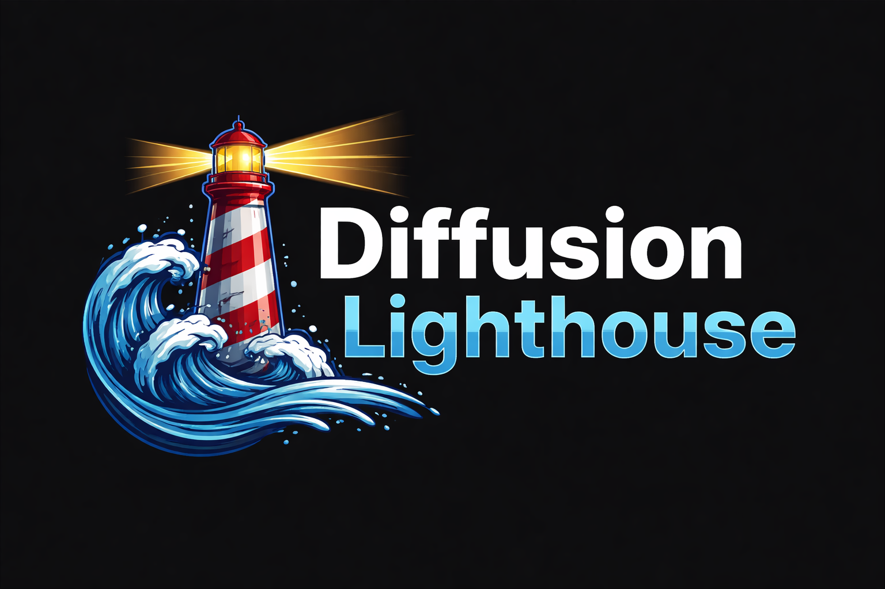

<p align="center">
  
</p>

<h1 align="center">🌊 Diffusion Lighthouse</h1>

<p align="center">
  A curated, dataset-first, peer-reviewed index of diffusion-model research.
</p>

<p align="center">
  <a href="https://github.com/GKalliatakis/diffusion-lighthouse">
    
  </a>
  <a href="https://github.com/GKalliatakis/diffusion-lighthouse/issues">
    
  </a>
  <a href="LICENSE">
    
  </a>
  
  
</p>

---

**Diffusion Lighthouse** helps researchers, students, and practitioners orient themselves in a rapidly expanding diffusion-model literature by highlighting **peer-reviewed, conceptually meaningful work**, guided by **editorial judgment and citation context**.

> Like a lighthouse, this project does not chart every wave —  
> it helps you navigate toward the most important signals.

---

## 🌐 Website (canonical index)

👉 **https://GKalliatakis.github.io/diffusion-lighthouse/**

The website is the **single source of truth** for the paper index.

It supports:
- search, filtering, and sorting
- citation snapshots (“Cited by X”)
- paper-level details and relations
- explicit editorial annotations
- enforcement of the peer-review condition

If it’s not on the website, it’s **not included**.

---

## 🧭 Editorial principles (short version)

Diffusion Lighthouse is:

- **Peer-reviewed-first**  
  Only papers accepted at major conferences or journals are eligible.  
  arXiv-only, under-review, or workshop-only papers are excluded.

- **Dataset-first**  
  Papers are contextualized by the data distributions and modalities they model —  
  not organized primarily by benchmarks or leaderboards.

- **Idea-centric, not benchmark-centric**  
  Conceptual clarity, methodological insight, and long-term relevance matter more than marginal metric gains.

- **Editorially curated**  
  Inclusion is deliberate, documented, and revisable — not automatic.

The full inclusion bar is documented on the website:
👉 **/editorial-policy**

---

## 📊 Citation counts

- Citation numbers come from **Google Scholar**
- They are:
  - best-effort snapshots
  - not real-time
  - sometimes merged across versions
- Citation counts provide **context**, not authority

Lighthouse prioritizes **clarity and transparency** over scraping completeness.

---

## 🗂️ Repository structure

```
data/
  papers.yaml        # Human-curated source of truth
public/data/
  papers.json        # Build artifact consumed by the website
scripts/
  update_citations.py
  validation/        # (peer-review & schema checks)
site/
  index.html
  app.js
  style.css          # GitHub Pages site
```

- Paper metadata is **human-curated**
- Citation counts are **machine-updated**
- The website is generated from the data, not the README

---

## 🤝 Contributing

Contributions are welcome — with an emphasis on **signal over exhaustiveness**.

You can help by:
- adding missing **peer-reviewed diffusion papers**
- improving dataset, method, or concept tags
- fixing venues, years, or canonical links (DOI / proceedings)
- reporting citation inconsistencies

See [`CONTRIBUTING.md`](CONTRIBUTING.md) for:
- required fields
- the peer-review enforcement rule
- editorial acceptance criteria

> Inclusion is selective by design.

---

## ⚠️ Disclaimer

- Diffusion Lighthouse does **not** claim authority over what *should* matter
- Citations are an imperfect proxy for impact
- Inclusion ≠ endorsement

This project is a **navigation aid**, not a leaderboard or a gatekeeper.

---

## 📜 License

MIT License.

---

## 🧠 Updating citation snapshots locally

```bash
pip install -r requirements.txt
python scripts/update_citations.py
```

Citation updates do not automatically imply inclusion —  
editorial review still applies.
